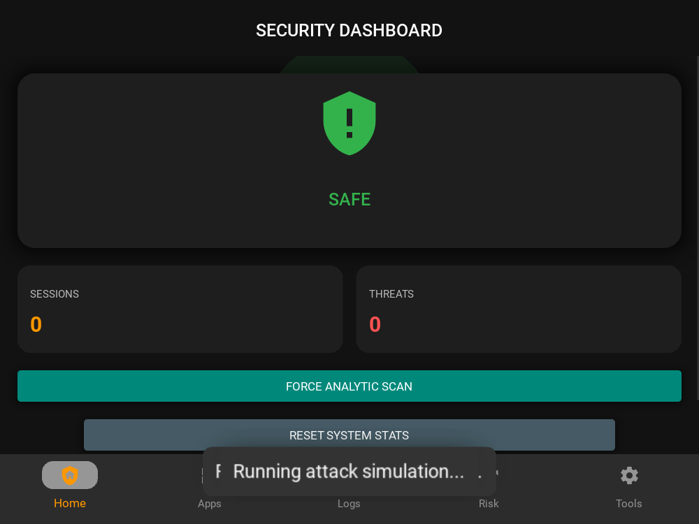
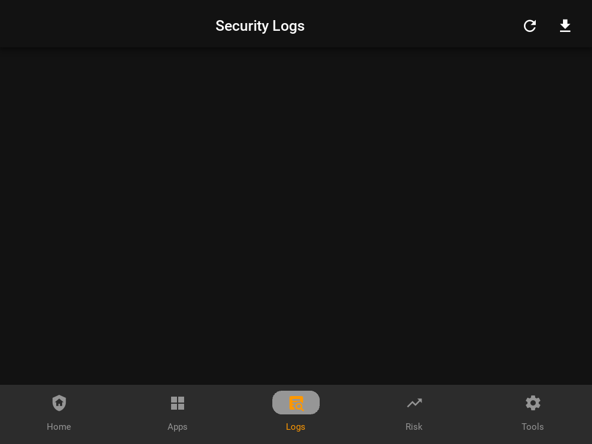

# 🛡️ NetGuard101: AI-Powered Mobile IDPS - Project Evaluation Report

**Developer:** Muhammad Ibrahim
**Mentorship:** Dr. Khurram Shehzad
**GitHub Repository:** [NetGuard101_SEECS](https://github.com/mibrahimlgsjt/NetGuard101_SEECS)
**Date:** February 18, 2026
**Version:** 1.0.0 (Stable)
**Platform:** Android (Primary), Windows (Dev/Demo)

---

## 1. Executive Summary

**NetGuard101** represents a significant advancement in mobile security, bridging the gap between academic research and consumer application. It is a comprehensive **Intrusion Detection and Prevention System (IDPS)** designed specifically for the resource constraints of Android devices. 

Unlike traditional mobile firewalls that rely solely on static blacklists, NetGuard101 employs a **Hybrid Defense Engine**. This engine integrates:
1.  **Rule-Based Filtering:** Instantaneous blocking of known malicious signatures (SQL injection, XSS payloads) and blacklisted IPs.
2.  **Edge-AI Behavioral Analysis:** A TensorFlow Lite model running locally on the device to detect zero-day anomalies—such as DDoS flooding and port scanning—by analyzing packet arrival rates and feature vectors in real-time.

The application features a professional **Material Design 3** interface (KivyMD), ensuring that complex security metrics are accessible to non-technical users through intuitive visualizations, while offering deep technical logs for security professionals.

---

## 2. Technical Architecture & Implementation

The project is architected as a robust Python monolith, optimized for cross-platform deployment using the Kivy framework.

### 2.1 Core Technology Stack

| Component | Technology | Role & Implementation Details |
| :--- | :--- | :--- |
| **Language** | **Python 3.8+** | Primary logic, socket management, and data processing. |
| **UI Framework** | **Kivy & KivyMD** | Hardware-accelerated UI with Material Design 3 components. |
| **AI Engine** | **TensorFlow Lite** | On-device inference. Uses `tf.lite.Interpreter` with a `(1, 78)` input feature vector. |
| **Android Bridge** | **Pyjnius (JNI)** | Accesses native Java APIs (`UsageStatsManager`, `TrafficStats`) directly from Python. |
| **Cloud Backend** | **Supabase** | PostgreSQL database for collaborative threat intelligence sharing. |
| **Packaging** | **Buildozer** | Compiles the Python application into a standalone Android APK. |

### 2.2 Key Algorithms & Logic

#### 🧠 Hybrid Threat Detection Engine
The `AcademicSecurityManager` class orchestrates the defense logic:
*   **Signature Matching:** Scans packet payloads for byte sequences like `b"DROP TABLE"`, `b"SHELLCODE"`, or `b"\x90\x90..."` (NOP Sleds).
*   **Anomaly Detection (AI):** 
    *   Network traffic features are extracted and normalized.
    *   The TFLite model outputs a **Confidence Score (0.0 - 1.0)**.
    *   **Logic:** 
        *   `Score > 0.8`: **CRITICAL THREAT** (Auto-Block)
        *   `Score > 0.5`: **SUSPICIOUS** (Flag & Alert)

#### 📱 Native Android Integration (`android_utils.py`)
To overcome Python's sandbox limitations on Android, the app uses **Pyjnius** to interface with the Android OS:
*   **Traffic Monitoring:** Calls `android.net.TrafficStats.getTotalRxBytes()` to track real-time data usage.
*   **App Blocking Strategy:** Since Android restricts killing processes, NetGuard uses a **Foreground Override** technique. When a blacklisted app (`com.whatsapp`, etc.) is detected via `UsageStatsManager`, NetGuard launches a high-priority `Intent` to bring itself to the foreground, effectively overlaying the target app and preventing access.

#### ☁️ Collaborative Cloud Defense (`cloud_manager.py`)
*   **Real-Time Sync:** Threats detected on one device are asynchronously pushed to a central Supabase database (`threat_intel` table).
*   **Global Bans:** The app fetches a list of globally banned IPs from the `active_bans` table, creating a "herd immunity" effect where protection scales with the user base.

---

## 3. Application Features

### A. Main Dashboard (Active Shield)
The central hub of the application. The "Active Shield" pulses in real-time, changing color based on the threat level (Green=Safe, Orange=Suspicious, Red=Threat).
*   **Real-Time Traffic Graph:** Visualizes network packet volume.
*   **Quick Stats:** Displays total sessions scanned and threats blocked.



### B. Smart App Firewall
Allows users to manage internet access for installed applications.
*   **Usage Tracking:** Shows data consumption per app.
*   **One-Tap Block:** Instantly restricts an app's usage using the overlay technique described above.


### C. Network Logs & Intelligence
A detailed audit trail for security analysis.
*   **Granular Logging:** Records Timestamp, Source IP, Protocol, Port, and Event Type.
*   **Cloud Sync:** Integrates global threat data, distinguishing between "Local Blocks" and "Global Intel".



---

## 4. Installation & Deployment

### Prerequisites
*   **Development:** Python 3.10+, Kivy, KivyMD
*   **Android Build:** Linux/WSL (Ubuntu 22.04 recommended) with `buildozer`

### Running on Windows (Smart Demo Mode)
The application automatically detects it is not on Android and switches to **Demo Mode**, simulating hardware sensors and network traffic for presentation purposes.

1.  **Install Dependencies:**
    ```bash
    pip install kivymd kivy tensorflow
    ```
2.  **Launch Application:**
    ```bash
    python main.py
    ```
    *Note: The app will auto-inject simulated attack traffic (Port Scans, DDoS) to demonstrate the detection engine.*

### Building for Android
To generate the APK file:
1.  Connect your Android device with USB Debugging enabled.
2.  Execute the build command:
    ```bash
    buildozer android debug deploy run
    ```

---

## 5. Project Evaluation & Future Roadmap

### 5.1 Innovation Points
*   **Edge-AI Implementation:** Successfully running a TensorFlow Lite model within a Kivy Python environment on Android is a non-trivial technical achievement.
*   **Privacy-First Architecture:** By processing logic locally, NetGuard respects user privacy compared to cloud-only VPN firewalls.

### 5.2 Future Improvements
*   **Root-Layer Firewall:** Leveraging `iptables` on rooted devices for packet-level dropping (removing the need for the overlay hack).
*   **iOS Support:** Migrating the UI to Kivy-iOS for Apple device support.
*   **Enterprise Dashboard:** A web-based admin panel for IT managers to view fleet-wide threat statistics via Supabase.

---

*Report generated for NetGuard101 Evaluation.*
