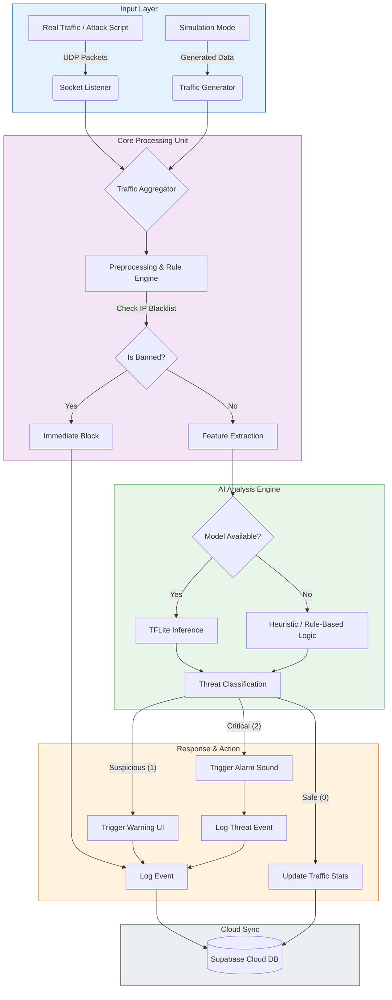

# NetGuard IDPS Algorithm Pipeline

This diagram illustrates the flow of data through the NetGuard Intrusion Detection and Prevention System, from traffic ingress to threat mitigation and reporting.

## Description of Stages

1.  **Input Layer**: System accepts traffic from either real-world network sockets (listening for packets from `attack_script.py`) or an internal simulation engine for demonstration.
2.  **Core Processing**:
    *   **Aggregator**: Unifies data streams.
    *   **Rule Engine**: Checks against static rules (e.g., known bad IPs) for immediate blocking.
3.  **AI Analysis**:
    *   **Feature Extraction**: Parses packet metadata (Size, Port, Protocol).
    *   **Inference**: Uses a lightweight TensorFlow Lite model to predict threat levels. Falls back to robust heuristics if the model is unavailable.
4.  **Response Layer**:
    *   **Safe**: Updates normal traffic counters.
    *   **Suspicious**: Alerts the user visually.
    *   **Critical**: Triggers an audible alarm and logs the incident as a high-priority threat.
5.  **Cloud Integration**: Asynchronously pushes logs and stats to Supabase for remote monitoring and historical auditing.
